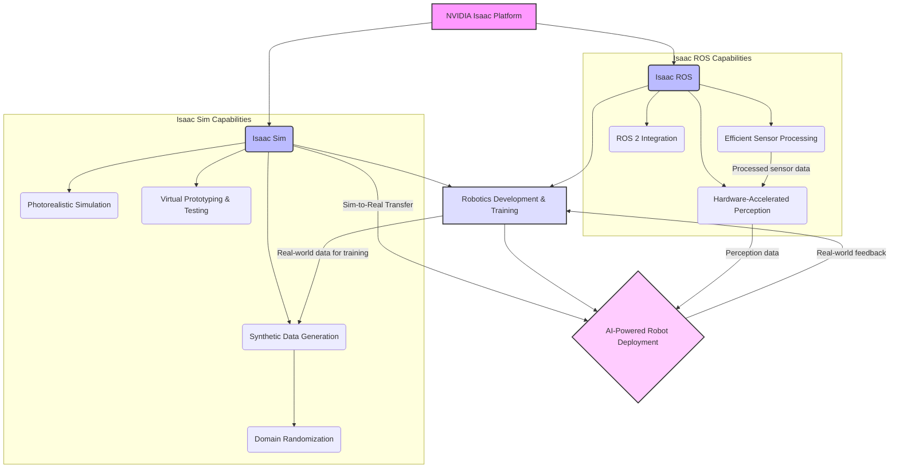

## Introduction to NVIDIA Isaac

NVIDIA Isaac is a comprehensive platform designed to accelerate the development, simulation, and deployment of AI-powered robots. It brings together a suite of software, hardware, and tools that enable developers to create intelligent machines capable of perceiving, reasoning, and acting autonomously in complex environments. At its core, Isaac addresses the unique challenges of robotics by leveraging NVIDIA's expertise in GPU-accelerated computing and artificial intelligence.

The platform is broadly divided into two main components: **NVIDIA Isaac Sim** and **NVIDIA Isaac ROS**, each serving distinct but complementary roles in the robotics development lifecycle.

## Isaac Sim vs. Isaac ROS

### NVIDIA Isaac Sim

Isaac Sim is a scalable, cloud-native robotics simulation platform built on NVIDIA Omniverse. It provides a photorealistic, physically accurate virtual environment where developers can:

*   **Design and Test Robots**: Rapidly prototype, assemble, and test robotic systems in a simulated world before deploying them to physical hardware.
*   **Generate Synthetic Data**: Create vast amounts of high-quality synthetic data to train AI models. This is crucial for overcoming the limitations of real-world data collection, which can be expensive, time-consuming, and dangerous. Isaac Sim supports **domain randomization**, a technique that introduces variations in simulation (e.g., lighting, textures, object positions) to improve the generalization of models to real-world conditions.
*   **Develop and Validate AI Models**: Integrate AI perception, navigation, and manipulation algorithms directly within the simulation, enabling iterative development and validation.

**Key Characteristics of Isaac Sim:**
*   **Photorealistic Rendering**: High-fidelity visual output, critical for training perception models that need to recognize objects and scenes realistically.
*   **Physically Accurate Simulation**: Realistic physics engine ensures that robot behaviors in simulation closely mimic those in the real world.
*   **Scalable**: Can be deployed on local workstations or in the cloud, allowing for parallel simulation and large-scale data generation.
*   **Omniverse Integration**: Benefits from the Universal Scene Description (USD) framework for seamless asset and environment creation.

### NVIDIA Isaac ROS

Isaac ROS is a collection of hardware-accelerated packages and developer tools that seamlessly integrate with the Robot Operating System (ROS 2). Its primary goal is to optimize the performance of AI and robotics applications on NVIDIA hardware, particularly NVIDIA Jetson platforms.

**Isaac ROS enables:**
*   **Hardware-Accelerated Perception Pipelines**: Utilizes NVIDIA GPUs to significantly speed up computationally intensive tasks such as image processing, object detection, and semantic segmentation. This allows robots to process sensor data in real-time, which is critical for autonomous operation.
*   **Efficient Sensor Data Processing**: Provides optimized components for handling camera feeds, depth sensors, LiDAR, and IMUs, turning raw data into actionable insights much faster than traditional CPU-bound methods.
*   **Integration with ROS 2**: Offers a robust framework for building modular robotics applications, leveraging the extensive ROS 2 ecosystem while benefiting from GPU acceleration.

**Key Characteristics of Isaac ROS:**
*   **Performance**: Drastically reduces latency and increases throughput for AI inference and complex algorithms.
*   **Modularity**: Integrates as standard ROS 2 packages, allowing developers to pick and choose components.
*   **Hardware Optimization**: Specifically tuned for NVIDIA Jetson and other NVIDIA GPU architectures.

### Conceptual Diagram: NVIDIA Isaac Ecosystem

## Role in Physical AI and Embodied Intelligence

NVIDIA Isaac plays a pivotal role in the advancement of Physical AI and embodied intelligence. Physical AI refers to intelligent systems that interact with the real world, requiring robust perception, decision-making, and action capabilities. Embodied intelligence extends this to systems that possess a physical body, like robots, and learn through interaction with their environment.

### How Isaac Contributes:

1.  **Accelerated Development Cycle**: Isaac Sim allows for rapid iteration and testing in a safe, controlled virtual environment, drastically reducing the time and cost associated with physical robot experimentation.
2.  **High-Quality Training Data**: Synthetic data generated by Isaac Sim overcomes the scarcity and biases of real-world data, enabling AI models to be trained more effectively and robustly for diverse scenarios.
3.  **Real-Time Performance**: Isaac ROS provides the computational horsepower needed for robots to process complex sensor data and execute AI inference in real-time, a non-negotiable for autonomous navigation and manipulation.
4.  **Sim-to-Real Transfer**: The platform is designed with "sim-to-real" transfer in mind, providing tools and methodologies to bridge the gap between simulated training and real-world deployment. This allows models trained in virtual environments to perform effectively on physical robots.

By combining realistic simulation with high-performance, real-world execution capabilities, NVIDIA Isaac empowers developers to push the boundaries of what's possible in robotics, leading to more intelligent, adaptable, and autonomous physical AI systems.

## Exercises and Questions

1.  **Question**: Differentiate between NVIDIA Isaac Sim and NVIDIA Isaac ROS, outlining their primary functions and how they contribute to the overall NVIDIA Isaac platform.
    *   **Hint**: Consider their roles in simulation/data generation versus real-time processing/deployment.
    *   **Answer**: Isaac Sim focuses on photorealistic simulation, synthetic data generation, and virtual prototyping, while Isaac ROS provides hardware-accelerated ROS 2 packages for real-time perception and processing on physical robots. Both are components of the broader NVIDIA Isaac platform for AI robotics.

2.  **Question**: Explain the concept of "Physical AI" and "embodied intelligence". How does the NVIDIA Isaac platform support the development of systems exhibiting these characteristics?
    *   **Hint**: Think about interaction with the real world and physical bodies.
    *   **Answer**: Physical AI involves intelligent systems interacting with the physical world; embodied intelligence extends this to physical bodies (robots) learning through interaction. NVIDIA Isaac supports this by enabling accelerated development in simulation (Isaac Sim), providing high-quality training data (synthetic data, domain randomization), and ensuring real-time performance on hardware (Isaac ROS) for real-world deployment and interaction.

3.  **Question**: Why is "synthetic data generation" and "domain randomization" crucial for training AI models for robotics, especially when using platforms like Isaac Sim?
    *   **Hint**: Consider the challenges of real-world data and the need for model generalization.
    *   **Answer**: Synthetic data generation overcomes the limitations of scarce, expensive, or dangerous real-world data collection. Domain randomization further enhances this by introducing variations in simulated data, which helps AI models generalize better to the unpredictable conditions of the real world, preventing overfitting to specific simulated environments.

## For RAG Chatbot Integration

**Key Topics**:
*   `NVIDIA Isaac Platform Overview`
*   `Isaac Sim vs Isaac ROS`
*   `Role of Isaac in Physical AI`
*   `Synthetic Data and Domain Randomization`
*   `Hardware Acceleration in Isaac ROS`

**FAQs & Snippets**:

What is the NVIDIA Isaac Platform?

NVIDIA Isaac is a comprehensive platform designed to accelerate the development, simulation, and deployment of AI-powered robots. It integrates software, hardware, and tools to enable intelligent machines to perceive, reason, and act autonomously.

What is the difference between Isaac Sim and Isaac ROS?

**Isaac Sim** is a simulation platform for virtual prototyping, synthetic data generation, and training AI models in photorealistic environments. **Isaac ROS** is a collection of hardware-accelerated ROS 2 packages that optimize AI and robotics applications for real-time performance on NVIDIA hardware, such as Jetson platforms.

How does Isaac Sim help in training AI models?

Isaac Sim generates vast amounts of high-quality synthetic data in physically accurate virtual environments. This data, often enhanced with domain randomization, helps overcome the limitations of real-world data collection, allowing AI models to be trained more effectively and to generalize better to real-world conditions.

What is Physical AI?

Physical AI refers to intelligent systems that interact with the real world, requiring robust perception, decision-making, and action capabilities. NVIDIA Isaac contributes by providing tools for accelerated development, high-quality training data, and real-time performance.

