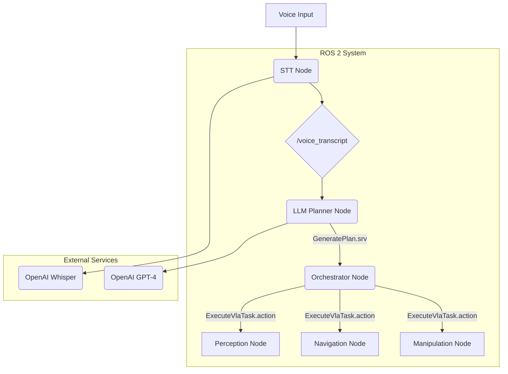

# Chapter 1: The VLA Philosophy

Welcome to Module 4, the capstone of our journey into Physical AI and Humanoid Robotics! In the previous modules, you mastered the fundamentals of ROS 2, learned how to simulate worlds and robots, and explored the powerful capabilities of NVIDIA's Isaac Sim. Now, it's time to bring it all together and build a truly intelligent agent.

### Learning Objectives

By the end of this chapter, you will be able to:

-   Define what a Vision-Language-Action (VLA) pipeline is.
-   Understand the role of each component: Vision, Language, and Action.
-   Explain why VLA is a transformative approach in modern robotics.
-   Describe the architecture of the capstone project we will build.

---

## 1. What is a Vision-Language-Action (VLA) Pipeline?

At its core, a Vision-Language-Action pipeline is a control architecture that allows a robot to **see** the world, **understand** human language, and **act** upon that understanding. It's a paradigm shift from traditional robotics, where robots were programmed with explicit, task-specific instructions. With VLA, we are building robots that can interpret ambiguous, high-level commands, much like a human would.

Let's break it down:

-   **Vision (The Robot's Eye)**: This component is responsible for perceiving and understanding the environment through cameras and other sensors. It's not just about seeing pixels; it's about identifying objects, understanding their spatial relationships, and building a semantic map of the world.

-   **Language (The Robot's Ear & Brain)**: This is where Large Language Models (LLMs) come in. This component listens to human commands (via Speech-to-Text), understands the intent behind them, and then formulates a high-level plan to achieve the goal. It's the cognitive engine of our robot.

-   **Action (The Robot's Body)**: Once a plan is formulated, this component translates the plan's abstract steps (e.g., "pick up the can") into concrete, low-level commands that the robot's motors and controllers can execute using ROS 2 actions for navigation and manipulation.

## 2. The Capstone Project: An Autonomous Humanoid Assistant

Throughout this module, we will be building a complete VLA pipeline for a simulated humanoid robot in Isaac Sim. The goal is to create an autonomous assistant that can perform helpful tasks based on simple voice commands.

### System Architecture

Here is a high-level diagram of the system we will build. Don't worry if it looks complex; we will build and explain each piece, one chapter at a time.

**The Flow:**

1.  A **voice command** is captured.
2.  The **STT Node** (Speech-to-Text) transcribes the audio into a text string.
3.  The **LLM Planner Node** receives the text and queries a powerful AI model (GPT-4) to create a logical, step-by-step plan.
4.  The **Orchestrator Node** takes this plan and executes it one step at a time.
5.  For each step, it calls the appropriate action server:
    -   **Navigation Node** to move the robot around (using Nav2).
    -   **Perception Node** to find and identify objects.
    -   **Manipulation Node** to pick up, move, or interact with objects (using MoveIt2).

---

## 3. Why This Matters: The Future of Robotics

Robots that can understand natural language and adapt to new instructions are the future. By learning to build VLA pipelines, you are positioning yourself at the forefront of the AI and robotics revolution. These are the foundational skills needed to create the next generation of personal assistants, warehouse workers, and exploratory robots.

### Key Takeaways

-   VLA stands for Vision, Language, and Action.
-   This architecture enables robots to understand high-level human commands.
-   Our capstone project will integrate ROS 2, Isaac Sim, and AI models to create an autonomous humanoid.

### Common Failure Modes to Consider
- **Misinterpretation:** What if the LLM misunderstands the command? The plan could be wrong.
- **Perception Failure:** What if the robot can't find the object it's looking for?
- **Execution Failure:** What if the robot fails to pick up an object or its path is blocked?

We will explore how to handle these failures in later chapters.

---

## 4. Chapter Quiz

1.  What does VLA stand for?
2.  What is the role of the "Language" component in a VLA pipeline?
3.  Which ROS 2 feature is used to execute long-running tasks like navigation or manipulation?
4.  In our architecture, which node is responsible for converting a plan into actions?

  
Answers

  1. Vision-Language-Action.
  2. To understand human commands (via STT and LLMs) and formulate a high-level plan.
  3. ROS 2 Actions.
  4. The Orchestrator Node.

---

Now that you understand the philosophy, let's get our hands dirty. In the next chapter, we will build the very first piece of our pipeline: the robot's ear.
