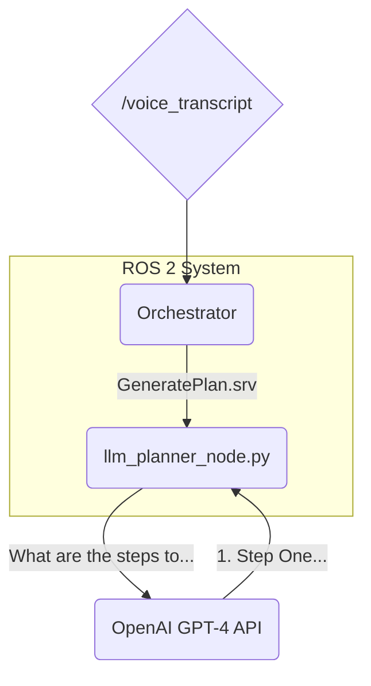

--- 
title: "Chapter 3: Language-to-Plan, The Robot's Brain"
sidebar_position: 3
---

# Chapter 3: Language-to-Plan, The Robot's Brain

Now that our robot can "hear" commands, it's time to give it a "brain." In this chapter, we'll build the cognitive engine of our VLA pipeline. This component will take the transcribed text from the previous chapter and use a Large Language Model (LLM) to convert a high-level goal into a concrete, step-by-step plan that the robot can execute.

### Learning Objectives

By the end of this chapter, you will be able to:

-   Create a ROS 2 service server.
-   Use the OpenAI client library to send prompts to GPT-4.
-   Understand the basics of prompt engineering for robotics.
-   Design a service that returns a structured plan.

---

## 1. Architecture: A Planning Service

We will create a ROS 2 service that our `Orchestrator` node (to be built later) can call whenever it needs a plan.



**Workflow:**

1.  The `Orchestrator` node will receive a transcribed command (e.g., "get me the red can").
2.  It will call our `/generate_plan` service, passing this command as the request.
3.  Our `llm_planner_node` receives the request, wraps the command in a carefully crafted prompt, and sends it to the GPT-4 API.
4.  GPT-4 responds with a numbered list of actions.
5.  The node parses this response and sends the list of steps back to the `Orchestrator`.

---

## 2. Prompt Engineering for Robotics

The "magic" of an LLM is unlocked by the quality of your prompt. We don't just send the raw text "get me the red can." We need to give the LLM context, constraints, and a desired output format. This is called **prompt engineering**.

Here is an effective prompt structure for our use case:

```
You are a helpful robot assistant. Your job is to take a high-level command and break it down into a simple, step-by-step plan that a robot can execute.

The robot has the following capabilities:
- navigate_to(location): Go to a specific location in the house (e.g., 'the kitchen table', 'the couch').
- find_object(object_description): Locate an object based on a description (e.g., 'the red can', 'a blue box').
- pick_up(object): Pick up the specified object.
- place(location): Place the currently held object at a location.

Based on the command below, generate a numbered list of steps. Do not include any other text or explanation.

Command: "{user_command}"
```

**Why this prompt is effective:**

-   **Role-playing**: "You are a helpful robot assistant." This sets the context for the LLM.
-   **Defining Capabilities**: We explicitly tell the model what the robot can do. This constrains the output to actions our robot can actually perform.
-   **Output Formatting**: "generate a numbered list... Do not include any other text." This makes the output easy to parse.
-   **Variable Injection**: `{user_command}` is where we will insert the transcribed text.

---

## 3. Creating the LLM Planner Node (`llm_planner_node.py`)

This node will host our `/generate_plan` service. We'll use the `vla_interfaces/srv/GeneratePlan.srv` definition we created earlier.

Here is the full code for the node. Place it in your `vla_nodes` package.

```python
# src/vla_nodes/vla_nodes/llm_planner_node.py

import rclpy
from rclpy.node import Node
from vla_interfaces.srv import GeneratePlan
from openai import OpenAI
import os

class LlmPlannerNode(Node):
    def __init__(self):
        super().__init__('llm_planner_node')
        self.srv = self.create_service(GeneratePlan, '/generate_plan', self.generate_plan_callback)
        self.client = OpenAI(api_key=os.environ.get("OPENAI_API_KEY"))
        self.get_logger().info('LLM Planner Service is ready.')

    def generate_plan_callback(self, request, response):
        self.get_logger().info(f'Received planning request: "{request.command}"')
        
        prompt = self.construct_prompt(request.command)
        
        try:
            llm_response = self.client.chat.completions.create(
                model="gpt-4",
                messages=[
                    {"role": "system", "content": "You are a helpful robot assistant."}, 
                    {"role": "user", "content": prompt}
                ]
            )
            
            plan_text = llm_response.choices[0].message.content
            plan_steps = self.parse_plan(plan_text)
            
            if not plan_steps:
                response.success = False
                response.error_message = "Failed to parse a valid plan from the LLM response."
                self.get_logger().error(response.error_message)
            else:
                response.success = True
                response.plan_steps = plan_steps
                self.get_logger().info(f"Generated plan with {len(plan_steps)} steps.")
        
        except Exception as e:
            response.success = False
            response.error_message = f"An error occurred: {str(e)}"
            self.get_logger().error(response.error_message)
            
        return response

    def construct_prompt(self, user_command):
        # This is the prompt engineering part
        return f"""
You are a helpful robot assistant. Your job is to take a high-level command and break it down into a simple, step-by-step plan that a robot can execute.

The robot has the following capabilities:
- navigate_to(location): Go to a specific location in the house (e.g., 'the kitchen table', 'the couch').
- find_object(object_description): Locate an object based on a description (e.g., 'the red can', 'a blue box').
- pick_up(object): Pick up the specified object.
- place(location): Place the currently held object at a location.

Based on the command below, generate a numbered list of steps. Do not include any other text or explanation.

Command: "{user_command}"
"""

    def parse_plan(self, plan_text):
        # A simple parser to extract numbered list items
        steps = []
        for line in plan_text.strip().split('\n'):
            line = line.strip()
            # Check if the line starts with a number and a dot (e.g., "1. ")
            if line and line[0].isdigit() and '.' in line:
                step = line.split('.', 1)[1].strip()
                steps.append(step)
        return steps

def main(args=None):
    rclpy.init(args=args)
    llm_planner_node = LlmPlannerNode()
    rclpy.spin(llm_planner_node)
    llm_planner_node.destroy_node()
    rclpy.shutdown()

if __name__ == '__main__':
    main()
```

### Code Breakdown

1.  **Service Creation**: We create a service named `/generate_plan` using our custom `GeneratePlan` interface.
2.  **Callback**: The `generate_plan_callback` is the core of the node. It's triggered whenever the service is called.
3.  **Prompt Construction**: It calls `construct_prompt` to wrap the user's command in our engineered context.
4.  **API Call**: It sends the prompt to the GPT-4 model using the `chat.completions.create` method.
5.  **Parsing**: The `parse_plan` function takes the raw text response from the LLM and extracts just the steps, converting the numbered list into a Python list of strings.
6.  **Response**: It populates the service response object with the `success` status and the `plan_steps` (or an `error_message`).

---

## 4. Launching and Testing

Add the new node to your launch file and `setup.py`. Then, after building, you can test the service from the command line.

First, run your launch file: `ros2 launch vla_nodes vla.launch.py`

In a second terminal, call the service:

```bash
ros2 service call /generate_plan vla_interfaces/srv/GeneratePlan "{command: 'please bring me the soda from the kitchen table'}"
```

You should see a response like this:

```
requester: making request: vla_interfaces.srv.GeneratePlan_Request(command='please bring me the soda from the kitchen table')
---
responder: sending response: vla_interfaces.srv.GeneratePlan_Response(plan_steps=['navigate_to(the kitchen table)', 'find_object(the soda)', 'pick_up(the soda)', 'navigate_to(user)'], success=True, error_message='')
```

Success! We have converted a natural language command into a structured, machine-readable plan.

---

## 5. Chapter Quiz

1.  What is prompt engineering?
2.  Why is it important to tell the LLM about the robot's capabilities?
3.  What ROS 2 feature did we use to expose the planning functionality to other nodes?
4.  What does the `parse_plan` function in our code do?

<details>
  <summary>Answers</summary>
  1. The process of carefully crafting the input (prompt) to an LLM to get a desired output format and content.
  2. It constrains the LLM's output to actions the robot can actually perform, making the plan realistic and executable.
  3. A ROS 2 Service.
  4. It extracts the steps from the LLM's numbered list response and returns them as a Python list of strings.
</details>

---

Our robot can now hear and think. In the next chapter, we will build the orchestrator that will begin to turn these thoughts into actions.

```