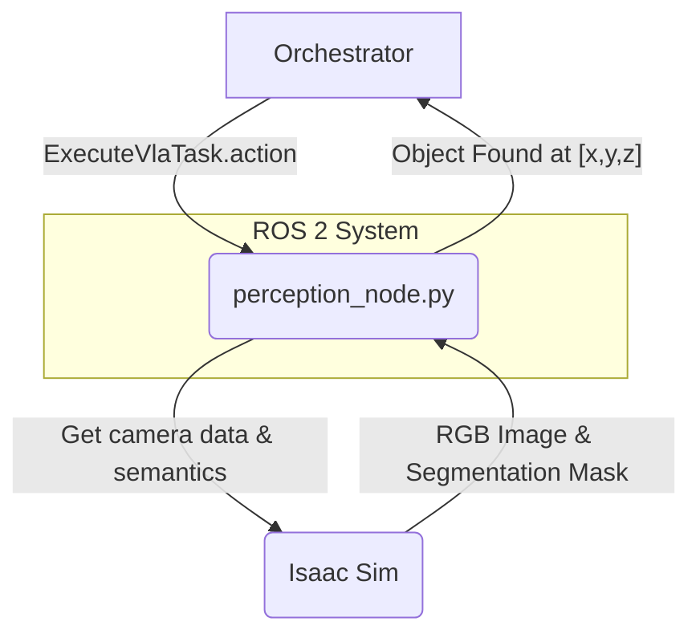

# Chapter 5: Vision Grounding, The Robot's Eye

A robot that can't see is just a voice assistant on wheels. In this chapter, we build the most critical link in the VLA chain: the ability to "ground" language in vision. This means connecting a linguistic concept like "the red can" to a specific cluster of pixels in the robot's camera feed. We'll create a ROS 2 action server that takes a textual description and returns the 3D coordinates of the matching object.

### Learning Objectives

By the end of this chapter, you will be able to:

-   Understand the concept of "grounding" in robotics.
-   Create a ROS 2 Action Server.
-   Use Isaac Sim's synthetic perception capabilities, like semantic segmentation.
-   Write a node that finds objects based on their properties (e.g., color).
-   Return the 3D position of a detected object.

---

## 1. Architecture: A Perception Action Server

We'll use a ROS 2 Action for this task because finding an object might take time. The `Orchestrator` can send a goal (e.g., "find the red can") and get continuous feedback while the perception node works.



**Workflow:**

1.  The `Orchestrator` sends a goal to the `/execute_vla_task` action server, hosted by our `perception_node`, with a `task_description` like "find the red can".
2.  The `perception_node` subscribes to the robot's camera topics in Isaac Sim, specifically the RGB image and a **semantic segmentation** image.
3.  It analyzes the images to find pixels that are both "red" and part of a "can" object.
4.  Once the object is found, it calculates its 3D position and returns it in the action result.

---

## 2. Synthetic Perception in Isaac Sim

Isaac Sim is incredibly powerful for perception tasks because it can provide perfect ground-truth data alongside the simulated camera images. We will use **Semantic Segmentation**.

**What is Semantic Segmentation?**
For every RGB image from the camera, Isaac Sim can generate a corresponding segmentation image. In this image, every pixel's value isn't a color, but rather an ID that corresponds to the *type* of object at that pixel. For example, all pixels belonging to a "can" will have one ID, while all pixels belonging to a "table" will have another.

We will configure our camera in Isaac Sim to publish:
1.  An RGB image.
2.  A depth image (to get 3D coordinates).
3.  A semantic segmentation image.
4.  Camera intrinsic parameters (to project pixels to 3D points).

---

## 3. Creating the Perception Node (`perception_node.py`)

This node hosts the `ExecuteVlaTask` action server for perception-related tasks. It's the most complex node so far, combining image processing with ROS 2 communications.

Here is the full code. Place it in your `vla_nodes` package.

```python
# src/vla_nodes/vla_nodes/perception_node.py

import rclpy
from rclpy.action import ActionServer
from rclpy.node import Node
import cv2
import numpy as np
from cv_bridge import CvBridge
from sensor_msgs.msg import Image, CameraInfo
from vla_interfaces.action import ExecuteVlaTask
import re

class PerceptionNode(Node):
    def __init__(self):
        super().__init__('perception_node')
        self._action_server = ActionServer(
            self,
            ExecuteVlaTask,
            '/execute_vla_task',
            self.execute_callback
        )
        # Subscribers for camera data from Isaac Sim
        self.rgb_sub = self.create_subscription(Image, '/camera/rgb', self.rgb_callback, 10)
        self.depth_sub = self.create_subscription(Image, '/camera/depth', self.depth_callback, 10)
        self.semantic_sub = self.create_subscription(Image, '/camera/semantic_segmentation', self.semantic_callback, 10)
        self.info_sub = self.create_subscription(CameraInfo, '/camera/camera_info', self.info_callback, 10)
        
        self.bridge = CvBridge()
        self.latest_rgb_image = None
        self.latest_depth_image = None
        self.latest_semantic_image = None
        self.camera_info = None

        self.get_logger().info("Perception Action Server is ready.")

    # Callbacks to store the latest data from camera topics
    def rgb_callback(self, msg):
        self.latest_rgb_image = self.bridge.imgmsg_to_cv2(msg, desired_encoding='bgr8')
    def depth_callback(self, msg):
        self.latest_depth_image = self.bridge.imgmsg_to_cv2(msg, desired_encoding='32FC1')
    def semantic_callback(self, msg):
        self.latest_semantic_image = self.bridge.imgmsg_to_cv2(msg, desired_encoding='mono8')
    def info_callback(self, msg):
        self.camera_info = msg

    def execute_callback(self, goal_handle):
        task_description = goal_handle.request.task_description
        self.get_logger().info(f'Executing perception task: "{task_description}"')

        # Basic parsing of the task description
        # A more robust solution would use NLP
        match = re.search(r"find the (\w+) (\w+)", task_description)
        if not match:
            goal_handle.abort()
            return ExecuteVlaTask.Result(success=False, final_status="Could not parse task description.")

        target_color_str = match.group(1)
        target_object_str = match.group(2)
        
        # This is a placeholder for mapping object names to semantic IDs
        # In a real system, this would come from a configuration file.
        semantic_map = {"can": 10, "box": 11, "table": 12}
        target_semantic_id = semantic_map.get(target_object_str, 0)
        
        if target_semantic_id == 0 or self.latest_rgb_image is None:
            goal_handle.abort()
            return ExecuteVlaTask.Result(success=False, final_status="Unknown object or no image data.")

        # --- Main Perception Logic ---
        # 1. Find pixels of the correct color
        hsv_image = cv2.cvtColor(self.latest_rgb_image, cv2.COLOR_BGR2HSV)
        # These HSV ranges would need to be tuned
        if target_color_str == "red":
            lower_bound = np.array([0, 120, 70])
            upper_bound = np.array([10, 255, 255])
        # Add other colors...
        else:
            goal_handle.abort()
            return ExecuteVlaTask.Result(success=False, final_status=f"Color '{target_color_str}' not supported.")
            
        color_mask = cv2.inRange(hsv_image, lower_bound, upper_bound)
        
        # 2. Find pixels of the correct object type (semantic segmentation)
        semantic_mask = (self.latest_semantic_image == target_semantic_id).astype(np.uint8) * 255
        
        # 3. Find where the masks overlap
        combined_mask = cv2.bitwise_and(color_mask, semantic_mask)
        
        # 4. Find the largest contour in the combined mask
        contours, _ = cv2.findContours(combined_mask, cv2.RETR_EXTERNAL, cv2.CHAIN_APPROX_SIMPLE)
        
        if not contours:
            goal_handle.abort()
            return ExecuteVlaTask.Result(success=False, final_status="Object not found in scene.")
            
        largest_contour = max(contours, key=cv2.contourArea)
        M = cv2.moments(largest_contour)
        if M["m00"] == 0:
            goal_handle.abort()
            return ExecuteVlaTask.Result(success=False, final_status="Could not calculate object center.")

        # 5. Get the center of the object in pixel coordinates
        center_x = int(M["m10"] / M["m00"])
        center_y = int(M["m01"] / M["m00"])

        # 6. Use depth camera data to get 3D coordinates
        # IMPORTANT: This is a simplified projection. A real implementation uses camera intrinsics.
        depth_value = self.latest_depth_image[center_y, center_x]
        # Assuming simple projection for demonstration
        obj_x = depth_value 
        obj_y = -(center_x - self.camera_info.width / 2.0) * depth_value / self.camera_info.k[0]
        obj_z = -(center_y - self.camera_info.height / 2.0) * depth_value / self.camera_info.k[4]

        self.get_logger().info(f"Object found at approximate coordinates: [{obj_x:.2f}, {obj_y:.2f}, {obj_z:.2f}]")
        
        goal_handle.succeed()
        return ExecuteVlaTask.Result(success=True, final_status=f"Object found at [{obj_x:.2f}, {obj_y:.2f}, {obj_z:.2f}]")

def main(args=None):
    rclpy.init(args=args)
    perception_node = PerceptionNode()
    rclpy.spin(perception_node)
    perception_node.destroy_node()
    rclpy.shutdown()

if __name__ == '__main__':
    main()

```

### Code Breakdown

1.  **Action Server**: The node creates an action server for `/execute_vla_task`.
2.  **Subscribers**: It subscribes to all necessary camera topics from Isaac Sim. The callbacks simply store the latest message.
3.  **`execute_callback`**: This is where the magic happens.
    -   It does very simple parsing on the `task_description` to get the color and object type. A real system would use more advanced Natural Language Processing (NLP).
    -   It creates a **color mask** by converting the RGB image to HSV (Hue, Saturation, Value) color space, which is more reliable for color detection.
    -   It creates a **semantic mask** by finding all pixels that match the object's semantic ID.
    -   It combines the two masks with a bitwise AND operation. The result is a mask showing only the pixels that are *both* the right color AND the right object type.
    -   It finds the center of the largest object in this final mask.
    -   Using the center pixel's coordinates and the corresponding value from the depth image, it performs a simplified projection to estimate the object's 3D position in the camera's coordinate frame.
    -   Finally, it succeeds the action and returns the found coordinates in the `final_status`.

---

## 4. Testing the Perception Node

You would launch this node and then use the `ros2 action send_goal` command to test it.

```bash
ros2 action send_goal /execute_vla_task vla_interfaces/action/ExecuteVlaTask "{task_description: 'find the red can'}"
```

You should see the node log that it found the object and its coordinates, and the action goal should report success.

---

## 5. Chapter Quiz

1.  What is "grounding" in the context of VLA?
2.  What is semantic segmentation, and why is it useful?
3.  Why did we use an Action Server instead of a Service for this node?
4.  What two masks did we combine to isolate the target object?

<details>
  <summary>Answers</summary>
  1. It is the process of connecting abstract concepts from language (like "red can") to specific data from sensors (like a group of pixels in an image).
  2. It's an image where each pixel's value is the ID of the object class it belongs to. It's useful because it allows us to find all pixels of a certain object type (e.g., all "cans") regardless of their color or appearance.
  3. Because finding an object can be a long-running task, and Actions allow for continuous feedback and the ability to cancel the goal.
  4. The color mask (from HSV filtering) and the semantic mask (from the segmentation image).
</details>

---

Our robot can now see and understand where objects are. The next logical step is to build the orchestrator that can use this information to create and manage a complete task.
