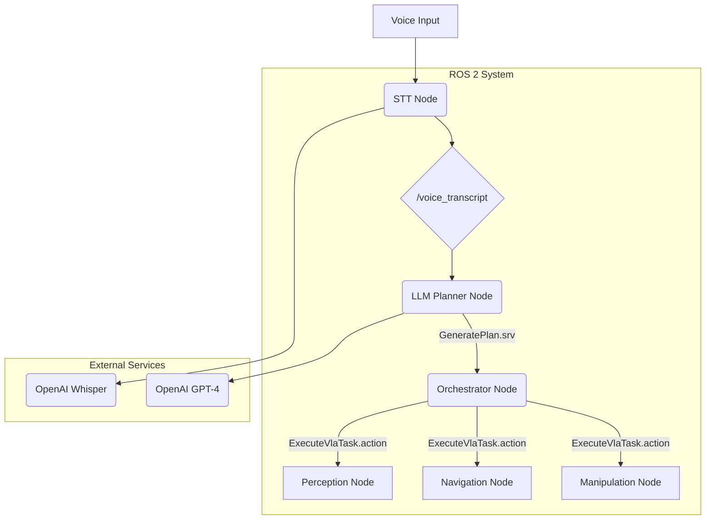

# Quickstart Guide: Module 4 - VLA Capstone

**Version**: 1.0
**Status**: DRAFT
**Author**: Gemini
**Created**: 2025-12-16
**Last Updated**: 2025-12-16

---

## 1. Project Goal

This document provides a high-level overview of the final VLA capstone project. The goal is to build a system where a simulated humanoid robot can understand and execute voice commands by integrating perception, language models, and robotic control.

## 2. System Architecture

The system is composed of several interconnected ROS 2 nodes, orchestrated to form a complete Vision-Language-Action pipeline.




### Node Descriptions

-   **STT Node**: Captures microphone audio and uses the OpenAI Whisper API to transcribe it to text. Publishes the transcript to the `/voice_transcript` topic.
-   **LLM Planner Node**: A service server that, when called with a text command, queries the OpenAI GPT-4 API to generate a multi-step, natural-language plan.
-   **Orchestrator Node**: The "brain" of the system. It calls the `GeneratePlan` service and then iterates through the plan steps. For each step, it calls the `ExecuteVlaTask` action, directing the task to the appropriate subsystem.
-   **Perception Node**: An action server that handles tasks like "find the red can." It uses the robot's camera feed and computer vision techniques to identify and locate objects.
-   **Navigation Node**: An action server (wrapping Nav2) that handles tasks like "navigate to the kitchen table."
-   **Manipulation Node**: An action server (wrapping MoveIt2 or an Isaac Sim equivalent) that handles tasks like "pick up the object."

## 3. Setup and Execution

1.  **Prerequisites**:
    -   Ubuntu 22.04 with ROS 2 Humble.
    -   NVIDIA Isaac Sim installed.
    -   Python 3.10+.
    -   OpenAI API Key.
2.  **Run the System**:
    -   Launch the Isaac Sim environment with the robot and scene.
    -   Launch the ROS 2 nodes using a master launch file:
        ```bash
        ros2 launch vla_bringup final_project.launch.py
        ```
    -   Issue a voice command and observe the robot.

---
