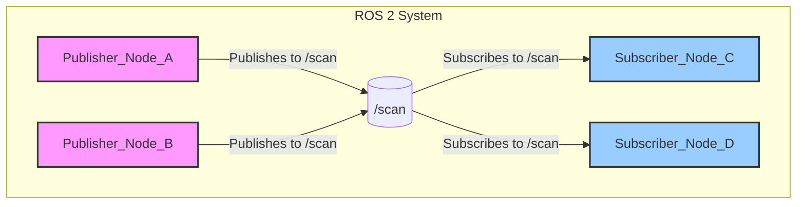

# Chapter 2: Nodes and Topics - The Building Blocks of ROS 2

### Learning Goals

In the last chapter, we introduced the high-level concepts of ROS 2. Now, we'll dive into the two most fundamental components: Nodes and Topics. By the end of this chapter, you will be able to:

-   Define a ROS 2 Node and its purpose.
-   Define a ROS 2 Topic and explain its role in asynchronous communication.
-   Understand the publisher/subscriber model.
-   Write a simple ROS 2 publisher and subscriber node in Python.
-   Use command-line tools to inspect nodes and topics.

---

### What is a ROS 2 Node?

A **Node** is the primary building block of a ROS 2 system. Think of it as a small, independent program that performs a single, well-defined task. For example, you might have:

-   A node for controlling the camera.
-   A node for reading the robot's laser scanner.
-   A node for planning a path from point A to point B.
-   A node for controlling the motors in the left wheel.

By breaking a complex system down into many simple nodes, ROS 2 applications become modular, scalable, and easy to debug. If the robot's path planning is failing, you can isolate and debug the "path_planning" node without affecting the camera or motor nodes.

Nodes are typically written in Python or C++ and are organized into **packages**. A package is a directory containing one or more nodes, along with configuration files that tell ROS 2 how to build and run them.

---

### What is a ROS 2 Topic?

Nodes need to exchange data. The camera node needs to send image data to the path planning node, which in turn needs to send movement commands to the motor control node. The primary mechanism for this in ROS 2 is the **Topic**.

A Topic is a named bus over which nodes exchange messages. It acts like a virtual bulletin board where nodes can post (publish) information or look for (subscribe to) information.

Key characteristics of Topics:

-   **Asynchronous**: Publishers post messages whenever they have new data, without waiting to see if anyone is listening. Subscribers receive messages as they arrive.
-   **Many-to-Many**: Many nodes can publish to the same topic, and many nodes can subscribe to the same topic.
-   **Strongly Typed**: Every topic has a specific message type. For example, a `/camera/image` topic might use a `sensor_msgs/Image` message type, while a `/cmd_vel` topic might use a `geometry_msgs/Twist` message type. This prevents nodes from sending or receiving malformed data.


*Diagram: The Publisher/Subscriber model. Multiple nodes can publish and subscribe to the same topic.*

---

### Your First ROS 2 Program: A Simple Publisher

Let's write a Python node that publishes a "Hello, World!" message to a topic. This example uses the `rclpy` (ROS Client Library for Python) library.

**File: `my_first_package/my_first_package/hello_publisher.py`**
```python
import rclpy
from rclpy.node import Node
from std_msgs.msg import String

class HelloPublisher(Node):
    def __init__(self):
        super().__init__('hello_publisher')
        self.publisher_ = self.create_publisher(String, 'chatter', 10)
        timer_period = 0.5  # seconds
        self.timer = self.create_timer(timer_period, self.timer_callback)
        self.i = 0

    def timer_callback(self):
        msg = String()
        msg.data = 'Hello World: %d' % self.i
        self.publisher_.publish(msg)
        self.get_logger().info('Publishing: "%s"' % msg.data)
        self.i += 1

def main(args=None):
    rclpy.init(args=args)
    hello_publisher = HelloPublisher()
    rclpy.spin(hello_publisher)
    # Destroy the node explicitly
    # (optional - otherwise it will be done automatically
    # when the garbage collector destroys the node object)
    hello_publisher.destroy_node()
    rclpy.shutdown()

if __name__ == '__main__':
    main()
```

**Code Breakdown:**
1.  **`import`**: We import the necessary libraries: `rclpy`, the `Node` class, and the `String` message type.
2.  **`HelloPublisher(Node)`**: We create a class that inherits from `Node`.
3.  **`super().__init__('hello_publisher')`**: We initialize the parent `Node` class and give our node a name: `hello_publisher`.
4.  **`self.create_publisher(String, 'chatter', 10)`**: We create a publisher.
    -   `String`: The message type.
    -   `'chatter'`: The name of the topic.
    -   `10`: The queue size. This limits the number of queued messages if a subscriber is not receiving them fast enough.
5.  **`self.create_timer(...)`**: We create a timer that calls `timer_callback` every 0.5 seconds.
6.  **`timer_callback`**: This function creates a `String` message, populates it with data, publishes it, and logs it to the console.
7.  **`main`**: This is the standard entry point for a ROS 2 Python node. It initializes `rclpy`, creates an instance of our node, and then `spins` the node, which keeps it running and responsive to callbacks.

---

### Your First ROS 2 Program: A Simple Subscriber

Now, let's create a subscriber to listen to the `chatter` topic.

**File: `my_first_package/my_first_package/hello_subscriber.py`**
```python
import rclpy
from rclpy.node import Node
from std_msgs.msg import String

class HelloSubscriber(Node):
    def __init__(self):
        super().__init__('hello_subscriber')
        self.subscription = self.create_subscription(
            String,
            'chatter',
            self.listener_callback,
            10)
        self.subscription  # prevent unused variable warning

    def listener_callback(self, msg):
        self.get_logger().info('I heard: "%s"' % msg.data)

def main(args=None):
    rclpy.init(args=args)
    hello_subscriber = HelloSubscriber()
    rclpy.spin(hello_subscriber)
    hello_subscriber.destroy_node()
    rclpy.shutdown()

if __name__ == '__main__':
    main()
```
**Code Breakdown:**
1.  **`create_subscription`**: This is the core of the subscriber.
    -   `String`: The message type (must match the publisher).
    -   `'chatter'`: The topic name (must match the publisher).
    -   `self.listener_callback`: The function to call whenever a message is received.
    -   `10`: The queue size.
2.  **`listener_callback`**: This function receives the message object (`msg`) as an argument and simply logs its contents to the console.

To run these, you would open two separate terminals, source your ROS 2 environment, and run each node:
-   Terminal 1: `ros2 run my_first_package hello_publisher`
-   Terminal 2: `ros2 run my_first_package hello_subscriber`

You will see the publisher's output in Terminal 1 and the subscriber's "I heard..." message in Terminal 2.

---

### Command-Line Inspection

ROS 2 provides powerful command-line tools to inspect what's happening in the system.

-   **`ros2 node list`**: Shows all the running nodes.
    ```bash
    $ ros2 node list
    /hello_publisher
    /hello_subscriber
    ```
-   **`ros2 topic list`**: Shows all the active topics.
    ```bash
    $ ros2 topic list
    /chatter
    /parameter_events
    /rosout
    ```
-   **`ros2 topic echo <topic_name>`**: Lets you see the data being published on a topic in real-time, without having to write a subscriber node.
    ```bash
    $ ros2 topic echo /chatter
    ---
    data: 'Hello World: 10'
    ---
    data: 'Hello World: 11'
    ---
    ```

---

### Exercises

1.  Modify the `hello_publisher.py` to publish your name instead of "Hello World".
2.  Create a new Python script for a subscriber that listens to the `/chatter` topic and prints the length of the received message string.
3.  With the publisher and subscriber running, use the command line to find out the message type of the `/chatter` topic. (Hint: `ros2 topic info /chatter`).

---

### Quiz

1.  What is the main advantage of the node-based architecture in ROS 2?
    a) It makes the code run faster.
    b) It allows for modular, reusable, and easy-to-debug components.
    c) It's the only way to use Python.
    d) It saves battery life on the robot.

2.  What kind of communication are Topics used for?
    a) Asynchronous, one-to-many or many-to-many communication.
    b) Synchronous, one-to-one request/response.
    c) Long-running goals with feedback.
    d) Storing configuration data.

3.  What command would you use to see the data being published on a topic named `/robot/pose`?
    a) `ros2 node list`
    b) `ros2 topic info /robot/pose`
    c) `ros2 topic echo /robot/pose`
    d) `ros2 run robot pose`

---
### References
- ROS 2 Documentation. (n.d.). *Understanding nodes*. Retrieved from https://docs.ros.org/en/humble/Tutorials/Beginner-CLI-Tools/Understanding-ROS2-Nodes/Understanding-ROS2-Nodes.html
- ROS 2 Documentation. (n.d.). *Understanding topics*. Retrieved from https://docs.ros.org/en/humble/Tutorials/Beginner-CLI-Tools/Understanding-ROS2-Topics/Understanding-ROS2-Topics.html
- The Construct. (2020). *ROS2 Basics in 5 Days (Python)*.
