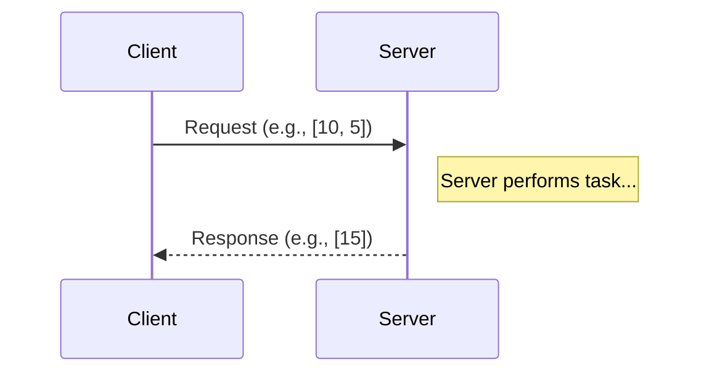
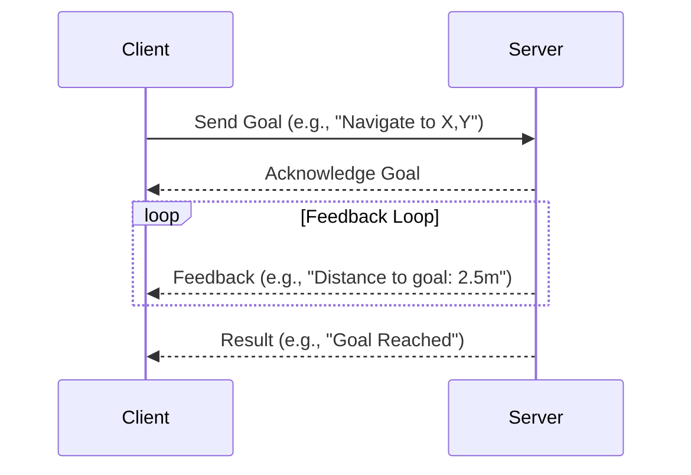

# Chapter 4: Services and Actions - Synchronous Communication

### Learning Goals

In the previous chapter, we explored asynchronous communication with Topics. Now, we'll cover ROS 2's mechanisms for synchronous and long-running tasks: Services and Actions. By the end of this chapter, you will be able to:

-   Distinguish between Topics, Services, and Actions.
-   Understand the request/response model of a Service.
-   Understand the goal/feedback/result model of an Action.
-   Write a simple ROS 2 Service server and client in Python.
-   Identify scenarios where using a Service or an Action is appropriate.

---

### When Topics Aren't Enough

Topics are great for continuous data streams, like a camera feed or laser scan data. The publisher doesn't need to know if anyone is listening, it just sends the data. But what if you need a two-way, confirmed transaction?

-   What if you need to ask a node to perform a calculation and give you the result?
-   What if you need to command a robot arm to move to a specific position and know for sure when it gets there?

For these scenarios, ROS 2 provides two powerful tools: **Services** and **Actions**.

| Communication Type | Best For                                    | Analogy                                           | Key Characteristics                                |
| ------------------ | ------------------------------------------- | -------------------------------------------------- | -------------------------------------------------- |
| **Topics**         | Continuous, unconfirmed data streams        | Radio broadcast                                   | Asynchronous, Publisher/Subscriber, Many-to-Many   |
| **Services**       | Quick, confirmed, request/response tasks    | Calling a function and getting a return value     | Synchronous, Server/Client, One-to-One (at a time) |
| **Actions**        | Long-running, confirmed tasks with feedback | Ordering a pizza and tracking its delivery status | Asynchronous, Server/Client, Cancellable, Provides Feedback |

---

### Services: The Request/Response Model

A **Service** is a synchronous communication pattern. A **client** node sends a single **request** to a **server** node and waits until it receives a single **response**. The client's code is "blocked"—it pauses and waits—until the response arrives. This is perfect for quick, transactional tasks.

**Use Case:** Imagine a "calculator" node. Another node could be a client that sends a request containing two numbers `[10, 5]` and asks the server to add them. The server performs the addition and sends back a response containing the result `[15]`.


*Diagram: A simple Service interaction.*

To define a service, you create a `.srv` file. This file specifies the data structure for the request and the response, separated by `---`.

**Example: `AddTwoInts.srv`**
```
int64 a
int64 b
---
int64 sum
```

#### Example: A Simple Service Client and Server

Let's see how this looks in Python. Here is a server that provides the `add_two_ints` service.

**File: `my_robot_pkg/my_robot_pkg/add_two_ints_server.py`**
```python
import rclpy
from rclpy.node import Node
from example_interfaces.srv import AddTwoInts # A standard, pre-defined service type

class AddIntsServer(Node):
    def __init__(self):
        super().__init__('add_ints_server')
        # Create the service. The type, name, and callback are required.
        self.srv = self.create_service(
            AddTwoInts, 'add_two_ints', self.add_two_ints_callback)
        self.get_logger().info('Service "add_two_ints" is ready.')

    def add_two_ints_callback(self, request, response):
        # The request and response are the types defined in the .srv file
        response.sum = request.a + request.b
        self.get_logger().info('Incoming request\na: %d b: %d' % (request.a, request.b))
        self.get_logger().info('Sending back response: [%d]' % response.sum)
        return response

def main(args=None):
    rclpy.init(args=args)
    add_ints_server = AddIntsServer()
    rclpy.spin(add_ints_server) # Keep the node alive to receive requests
    rclpy.shutdown()

if __name__ == '__main__':
    main()
```
And here is the client that calls the service.

**File: `my_robot_pkg/my_robot_pkg/add_two_ints_client.py`**
```python
import rclpy
from rclpy.node import Node
from example_interfaces.srv import AddTwoInts
import sys

class AddIntsClient(Node):
    def __init__(self):
        super().__init__('add_ints_client')
        # Create a client for the 'add_two_ints' service
        self.cli = self.create_client(AddTwoInts, 'add_two_ints')
        # Wait until the service is available
        while not self.cli.wait_for_service(timeout_sec=1.0):
            self.get_logger().info('Service not available, waiting again...')
        self.req = AddTwoInts.Request()

    def send_request(self, a, b):
        self.req.a = a
        self.req.b = b
        # Call the service asynchronously. This returns a "future" object.
        self.future = self.cli.call_async(self.req)
        return self.future

def main(args=None):
    rclpy.init(args=args)
    add_ints_client = AddIntsClient()
    
    # Get numbers from command-line arguments
    if len(sys.argv) != 3:
        add_ints_client.get_logger().error('Usage: ros2 run <pkg> <client> A B')
        return

    a = int(sys.argv[1])
    b = int(sys.argv[2])
    
    future = add_ints_client.send_request(a, b)

    # Spin until the future is complete (i.e., the response is received)
    rclpy.spin_until_future_complete(add_ints_client, future)

    try:
        response = future.result()
        add_ints_client.get_logger().info(
            'Result of add_two_ints: for %d + %d = %d' %
            (a, b, response.sum))
    except Exception as e:
        add_ints_client.get_logger().error(
            'Service call failed %r' % (e,))

    add_ints_client.destroy_node()
    rclpy.shutdown()

if __name__ == '__main__':
    main()
```
You can run the server and then call the client from the command line: `ros2 run my_robot_pkg add_two_ints_client 5 10`.

---

### Actions: For Long-Running Goals

Services are great, but they are blocking. If a task takes a long time (e.g., navigating across a room), the client node would be stuck waiting, unable to do anything else. Furthermore, the client gets no updates on the task's progress.

This is where **Actions** come in. Actions are asynchronous and non-blocking. They are designed for long-running, cancellable tasks that provide feedback.

The Action model has three parts:
1.  **Goal**: The client sends a goal to the server (e.g., "navigate to coordinates (X, Y)").
2.  **Feedback**: While the server works on the goal, it can publish periodic feedback (e.g., "current distance to goal is 2.5 meters").
3.  **Result**: When the task is finished, the server sends a final result (e.g., "succeeded" or "failed, obstacle detected").

The client can also send a request to cancel the goal at any time.


*Diagram: An Action interaction with a feedback loop.*

A common example is navigating a robot or controlling a robot arm through a complex trajectory. Writing Action clients and servers is more complex than Services, and we will cover a full implementation in a later chapter. For now, the key is to understand *when* to use them.

---

### Exercises

1.  Describe a real-world robot task that would be best implemented as a Service. Justify your choice.
2.  Describe a real-world robot task that would be best implemented as an Action. Justify your choice.
3.  What happens to a Service client if the server node crashes before sending a response?

---

### Quiz

1.  You need to create a way for a web interface to quickly query the current battery level of a robot. Which communication method is most appropriate?
    a) Topic
    b) Service
    c) Action
    d) Parameter

2.  You are programming a robot arm to pick up an object, a process that takes 15 seconds and involves multiple stages. You want to monitor the arm's progress. What should you use?
    a) Topic
    b) Service
    c) Action
    d) Node

3.  What is the main disadvantage of using a Service for a long-running task?
    a) It is not secure.
    b) It can only be used with C++.
    c) It blocks the client node from doing other work.
    d) It does not guarantee that the request will be received.

---
### References
- ROS 2 Documentation. (n.d.). *Understanding services*. Retrieved from https://docs.ros.org/en/humble/Tutorials/Beginner-CLI-Tools/Understanding-ROS2-Services/Understanding-ROS2-Services.html
- ROS 2 Documentation. (n.d.). *Understanding actions*. Retrieved from https://docs.ros.org/en/humble/Tutorials/Beginner-CLI-Tools/Understanding-ROS2-Actions/Understanding-ROS2-Actions.html
- Automatic Addison. (n.d.). *ROS 2 Services in Python*.
