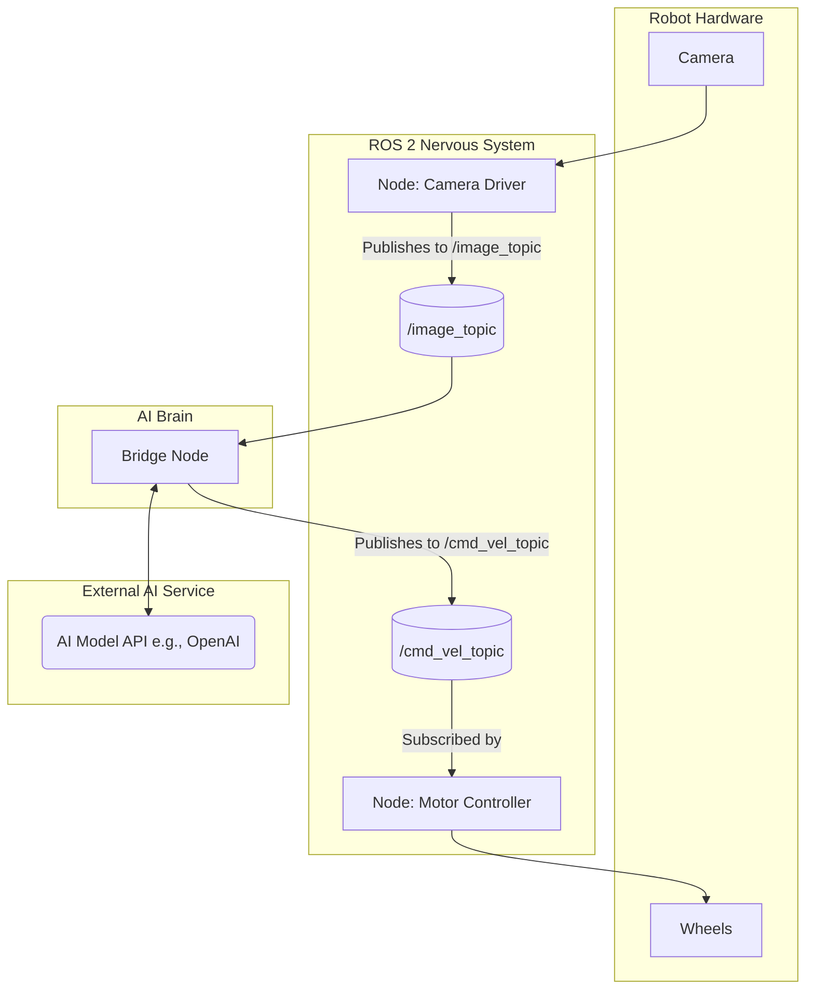

# Chapter 7: Bridging AI to ROS

### Learning Goals

So far, we have built robust communication structures with ROS 2. But how do we connect these structures to intelligent, decision-making algorithms? This chapter provides a conceptual bridge between the world of AI/ML and the world of robotics with ROS 2. By the end, you will be able to:

-   Describe two common patterns for integrating AI models into a ROS 2 system.
-   Understand the role of a "bridge" node.
-   Architect a simple system where an AI agent controls a robot's behavior through ROS 2.
-   Identify the importance of custom service and message definitions for AI applications.

---

### The "Brain" and the "Nervous System"

Think of your ROS 2 application—with its nodes, topics, services, and actions—as the robot's **nervous system**. It's the intricate wiring that allows sensors and motors to communicate and function.

An AI model, like a Large Language Model (LLM) or a computer vision model, acts as the **brain** or a specialized part of it. It performs the high-level reasoning, perception, and decision-making.

The challenge is connecting the brain to the nervous system. The AI model doesn't inherently know how to speak the language of ROS. We need to create a special "translator" node—a **bridge node**—that allows the AI to perceive the world through the robot's sensors and act upon the world through the robot's actuators.


*Diagram: The Bridge Node connects the ROS 2 "Nervous System" to the AI "Brain".*

---

### Pattern 1: The Real-Time Perception Loop (Topics)

This pattern is used for AI models that continuously process high-frequency sensor data. A classic example is an object detection model processing a camera feed.

**How it works:**
1.  A **Sensor Node** (e.g., a camera driver) publishes sensor data (e.g., images) to a topic (e.g., `/camera/image_raw`).
2.  An **AI Bridge Node** subscribes to this topic.
3.  For each incoming message, the AI node:
    a.  Pre-processes the data into a format the AI model understands (e.g., using `cv_bridge` to convert a ROS image to an OpenCV image).
    b.  Feeds the data into the AI model for inference (e.g., gets a list of detected objects and their bounding boxes).
    c.  Post-processes the model's output into a ROS message. This often requires a **custom message type**.
4.  The AI Bridge Node then **publishes** this result to a new topic (e.g., `/vision/detected_objects`).
5.  Other nodes in the system (like a path planner or a robotic arm controller) can subscribe to this results topic to make decisions.

This pattern is ideal for tasks like:
-   Object detection and tracking.
-   Lane detection for autonomous driving.
-   Real-time obstacle avoidance.

---

### Pattern 2: The Deliberate Action Loop (Services)

This pattern is used when the robot needs to perform a deliberate action based on a high-level command, often involving natural language or complex reasoning from an AI agent (like an LLM).

**How it works:**
1.  A **User Interface Node** (e.g., a voice command listener or a text input prompt) captures a high-level goal from a human.
2.  This node acts as a **Service Client**. It calls a service provided by the AI Bridge Node, sending the high-level goal (e.g., "Bring me the red ball") as the request.
3.  The **AI Bridge Node**, acting as a **Service Server**, receives the request.
4.  It communicates with an external or local AI model (e.g., calls the OpenAI API) to break down the high-level goal into a sequence of concrete, low-level robot commands.
    -   *AI Model Reasoning: "The user wants the red ball. First, I must locate the red ball. Then, I must navigate to it. Then, I must pick it up."*
5.  The AI Bridge Node translates these low-level commands into ROS 2 messages and publishes them to the relevant topics (e.g., publishing velocity commands to `/cmd_vel` or goal positions to `/arm_controller/goal`). It might also call other ROS 2 Actions (e.g., calling the navigation stack's `navigate_to_pose` action).
6.  Once the entire sequence is complete, the AI Bridge Node sends a response back to the Service Client, indicating success or failure.

#### Conceptual Code: An LLM-based Service Server

Let's imagine the Python code for a service server that takes a natural language command and uses an AI to generate a robot command.

**File: `ai_bridge_pkg/ai_bridge_pkg/llm_service_server.py`**
```python
# Conceptual Example: This code is illustrative and requires a real AI API integration.

import rclpy
from rclpy.node import Node
# We would need to create a custom service, e.g., "Command.srv"
# from my_interfaces.srv import Command 
# For this example, we'll just use a standard string service.
from example_interfaces.srv import Trigger # Using Trigger for simplicity. Let's pretend request holds the command.

# A placeholder for a real AI API call
def get_robot_command_from_ai(natural_language_command: str) -> str:
    # In a real application, this would be an HTTP request to an AI service.
    # e.g., response = openai.Completion.create(...)
    print(f"AI Model is processing the command: '{natural_language_command}'")
    if "move forward" in natural_language_command.lower():
        # The AI's output would be a structured format, like JSON
        # For simplicity, we just return a string here.
        return "FORWARD"
    else:
        return "STOP"

class LLMServiceServer(Node):
    def __init__(self):
        super().__init__('llm_service_server')
        # We'd create a publisher to send commands to the robot's motors
        # self.publisher_ = self.create_publisher(Twist, '/cmd_vel', 10)
        
        # For this example, we'll use a standard Service type.
        # A real implementation would use a custom service like:
        # self.srv = self.create_service(Command, 'llm_command', self.command_callback)
        self.srv = self.create_service(Trigger, 'llm_command', self.command_callback)
        self.get_logger().info('LLM Command Service is ready.')

    def command_callback(self, request, response):
        # In a real custom service, the command would be in the request field.
        # e.g., natural_language_command = request.command
        natural_language_command = "User said: move forward" # Hardcoded for this example
        
        self.get_logger().info(f'Received high-level command: "{natural_language_command}"')
        
        # Get the low-level command from our AI
        robot_command = get_robot_command_from_ai(natural_language_command)
        
        self.get_logger().info(f'AI decided on action: {robot_command}')

        # Here, you would publish the command to the robot's motor controller
        # e.g., twist_msg = Twist(); twist_msg.linear.x = 0.5; self.publisher_.publish(twist_msg)
        
        # The service response indicates that the command was processed.
        response.success = True
        response.message = f"AI processed command. Action: {robot_command}"
        return response

def main(args=None):
    rclpy.init(args=args)
    llm_service_server = LLMServiceServer()
    rclpy.spin(llm_service_server)
    rclpy.shutdown()

if __name__ == '__main__':
    main()
```
This conceptual example shows how a node can act as a bridge, receiving a high-level command via a ROS 2 service, communicating with an AI to get a low-level command, and then (conceptually) sending that command to the robot's actuators.

---

### Exercises

1.  You are building a robot that follows people. The robot uses a camera to detect a person and wheels to move. Which AI integration pattern would you use? Draw a diagram of the ROS 2 nodes and topics.
2.  You want to ask your robot, "What objects do you see in the room?" The robot needs to look around, identify objects using a vision model, and then speak the list of objects. Which pattern is more suitable? Why?
3.  Why are custom message and service definitions often necessary when working with AI models?

---

### Quiz

1.  What is the primary role of an AI "bridge" node?
    a) To run the AI model faster.
    b) To translate between the AI model's inputs/outputs and ROS 2 messages.
    c) To secure the ROS 2 system from the AI.
    d) To compile the AI model.

2.  Which ROS 2 communication method is best suited for a real-time object detection model that processes a continuous video stream?
    a) Services
    b) Actions
    c) Topics
    d) Parameters

3.  Why is the Service pattern a good choice for integrating a Large Language Model (LLM) that responds to specific user questions?
    a) Because LLMs send continuous streams of data.
    b) Because the interaction is a clear request (a question) and response (an answer).
    c) Because LLMs are always fast and never block.
    d) Because Topics cannot handle text data.
