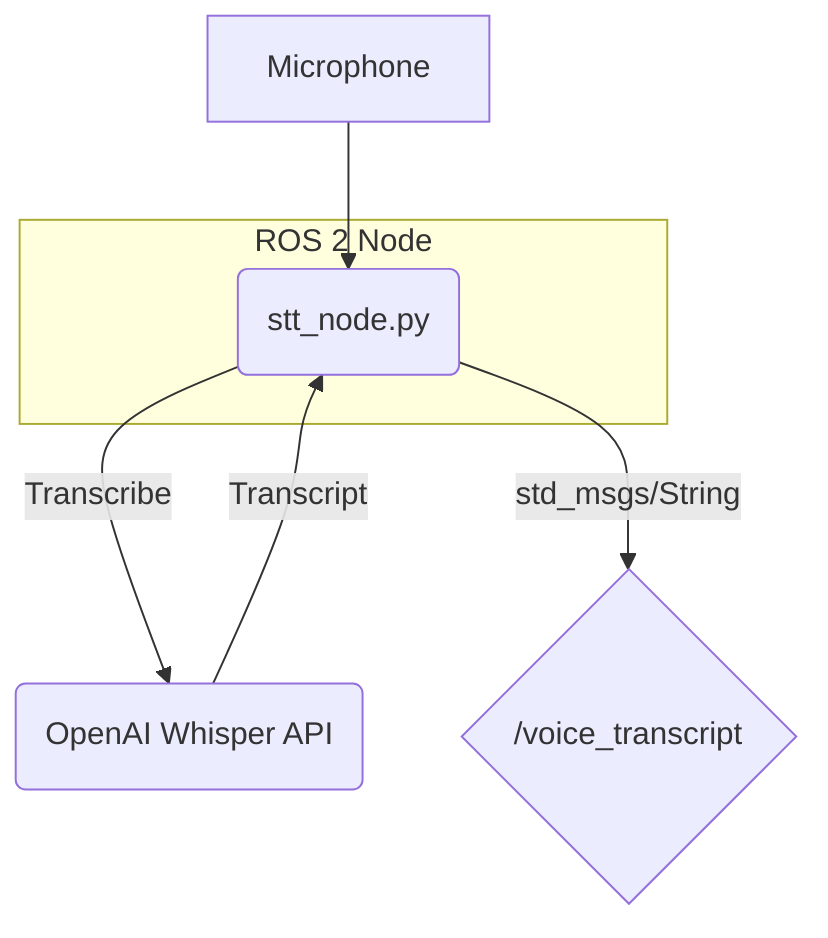

# Chapter 2: Voice-to-Text, The Robot's Ear

In this chapter, we'll build the first functional component of our VLA pipeline: the system that listens for voice commands and transcribes them into text. This involves capturing audio from a microphone and sending it to a Speech-to-Text (STT) engine.

### Learning Objectives

By the end of this chapter, you will be able to:

-   Create a Python ROS 2 node that can access a microphone.
-   Use the OpenAI client library to interact with the Whisper STT API.
-   Publish the transcribed text to a ROS 2 topic.
-   Launch and test the voice-to-text pipeline.

---

## 1. System Architecture for Voice-to-Text

The goal is simple: capture audio, transcribe it, and publish it. Here’s how our node will work:



Our `stt_node.py` will continuously listen for audio from the microphone. When it detects speech, it will send the audio data to the Whisper API, which returns a simple text transcript. This transcript is then published as a `std_msgs/String` message on the `/voice_transcript` topic for other nodes to use.

---

## 2. Setting Up the Environment

Before we write the code, make sure you have the required Python libraries installed.

```bash
pip install openai sounddevice
```

-   `openai`: The official Python client for interacting with OpenAI's APIs.
-   `sounddevice`: A library that provides an easy way to access your computer's microphone and speakers.

You will also need to get an API key from the [OpenAI Platform](https://platform.openai.com/) and set it as an environment variable.

```bash
export OPENAI_API_KEY='your-api-key-here'
```

---

## 3. Creating the STT Node (`stt_node.py`)

Let's create a new ROS 2 package for our Python nodes. You can call it `vla_nodes`. Inside that package, create a Python file named `stt_node.py`.

Here is the full code for the node. We will break it down below.

```python
# src/vla_nodes/vla_nodes/stt_node.py

import rclpy
from rclpy.node import Node
from std_msgs.msg import String
import sounddevice as sd
import numpy as np
from openai import OpenAI
import os
import tempfile

class SttNode(Node):
    def __init__(self):
        super().__init__('stt_node')
        self.publisher_ = self.create_publisher(String, '/voice_transcript', 10)
        self.client = OpenAI(api_key=os.environ.get("OPENAI_API_KEY"))
        
        # Audio settings
        self.samplerate = 16000  # Whisper requires 16kHz
        self.channels = 1
        self.silence_threshold = 0.01  # Adjust as needed
        self.silence_duration = 1.0  # Seconds of silence to trigger transcription
        
        self.get_logger().info('Voice-to-Text node started. Listening...')
        self.listen_for_speech()

    def listen_for_speech(self):
        # This is a simplified implementation. A real-world version would be more robust.
        # It records until there's a pause, then transcribes.
        
        while rclpy.ok():
            self.get_logger().info("Say a command...")
            
            recorded_data = []
            silent_frames = 0
            
            with sd.InputStream(samplerate=self.samplerate, channels=self.channels, dtype='float32') as stream:
                while rclpy.ok():
                    audio_chunk, overflowed = stream.read(self.samplerate) # Read 1 second of audio
                    is_silent = np.mean(np.abs(audio_chunk)) < self.silence_threshold
                    
                    if not is_silent:
                        silent_frames = 0
                        recorded_data.append(audio_chunk)
                    else:
                        silent_frames += 1
                    
                    # If we have recorded something and then there's silence, process it
                    if recorded_data and silent_frames >= self.silence_duration:
                        self.get_logger().info("Silence detected, transcribing...")
                        
                        full_recording = np.concatenate(recorded_data)
                        
                        # Save to a temporary file
                        with tempfile.NamedTemporaryFile(suffix=".wav", delete=False) as tmp_file:
                            import soundfile as sf
                            sf.write(tmp_file.name, full_recording, self.samplerate)
                            
                            # Transcribe
                            with open(tmp_file.name, "rb") as audio_file:
                                transcript = self.client.audio.transcriptions.create(
                                    model="whisper-1",
                                    file=audio_file
                                )
                                
                            os.remove(tmp_file.name) # Clean up the temp file
                        
                        if transcript.text:
                            self.get_logger().info(f'Transcript: "{transcript.text}"')
                            msg = String()
                            msg.data = transcript.text
                            self.publisher_.publish(msg)
                        
                        # Reset for next command
                        recorded_data = []
                        silent_frames = 0
                        break # Exit the inner loop to print "Say a command..." again

def main(args=None):
    rclpy.init(args=args)
    stt_node = SttNode()
    # We don't spin because the listening loop handles the process
    stt_node.destroy_node()
    rclpy.shutdown()

if __name__ == '__main__':
    main()
```

### Code Breakdown

1.  **Initialization**: We initialize a standard ROS 2 node, create a publisher for `/voice_transcript`, and instantiate the OpenAI client.
2.  **Audio Settings**: We define the sample rate (16kHz is required by Whisper), a threshold for detecting silence, and how long of a pause indicates the user has finished speaking.
3.  **`listen_for_speech` Loop**:
    *   It uses `sounddevice` to open an audio stream from the default microphone.
    *   It reads audio in chunks and checks if the chunk is "silent" by comparing the average volume to our `silence_threshold`.
    *   If it detects speech, it starts recording. Once it detects a pause (`silence_duration`), it stops recording.
4.  **Transcription**:
    *   The recorded audio is saved to a temporary WAV file. This is necessary because the OpenAI API expects a file.
    *   We open this file and send it to the `whisper-1` model for transcription.
5.  **Publishing**:
    *   The resulting text from the transcript is logged to the console and published to the `/voice_transcript` topic.
    *   The loop then resets to listen for the next command.

---

## 4. Launching and Testing

To run this node, you would add it to your `setup.py` as an entry point and then create a launch file.

**`vla.launch.py`**
```python
from launch import LaunchDescription
from launch_ros.actions import Node

def generate_launch_description():
    return LaunchDescription([
        Node(
            package='vla_nodes',
            executable='stt_node',
            name='stt_node',
            output='screen'
        )
    ])
```

After building your workspace (`colcon build`), you can launch the node:

```bash
ros2 launch vla_nodes vla.launch.py
```

You can now listen to the `/voice_transcript` topic in another terminal:

```bash
ros2 topic echo /voice_transcript
```

When you speak into your microphone, you should see the transcribed text appear in the second terminal!

---

## 5. Chapter Quiz

1.  What sample rate does the Whisper API require?
2.  Which Python library did we use to capture microphone audio?
3.  Why do we need to save the recorded audio to a temporary file?
4.  What is the ROS 2 message type used to publish the final transcript?

<details>
  <summary>Answers</summary>
  1. 16kHz (16000 Hz).
  2. `sounddevice`.
  3. The OpenAI API client library for transcription expects a file path, not a raw audio stream.
  4. `std_msgs/String`.
</details>

---

With the robot's "ear" now built, we are ready to tackle the next challenge: giving it a brain. In the next chapter, we'll take the transcribed text and use an LLM to understand what it means.
