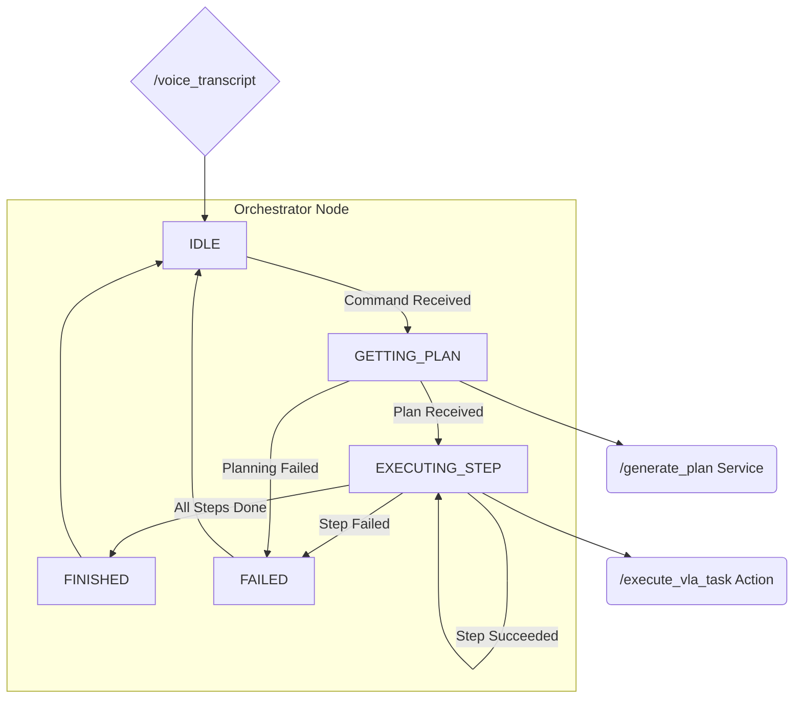

# Chapter 4: The Orchestrator, From Plan to Action

We've built the ears (STT) and the brain (LLM Planner). Now we need the central nervous system. The Orchestrator is the heart of our VLA pipeline, responsible for taking a high-level plan from the LLM and converting it into a sequence of concrete actions that the robot's body can perform. It manages the overall flow of a task, calling other nodes to handle the details and reacting to their success or failure.

### Learning Objectives

By the end of this chapter, you will be able to:

-   Design a state machine for managing a multi-step task.
-   Create a ROS 2 node that acts as both a Service Client and an Action Client.
-   Call a ROS 2 Service to get a plan.
-   Call a ROS 2 Action to execute a step in that plan.
-   Manage the sequence of a plan, moving from one step to the next.

---

## 1. Architecture: A State-Driven Orchestrator

The Orchestrator's primary job is to manage the state of a task. It takes a command, gets a plan, and then executes each step in sequence.



**State Machine:**

-   **IDLE**: The orchestrator waits for a command on the `/voice_transcript` topic.
-   **GETTING_PLAN**: When a command arrives, it calls the `/generate_plan` service.
-   **EXECUTING_STEP**: Once it has a plan, it iterates through the steps. For each step, it calls the `/execute_vla_task` action.
-   **FINISHED**: If all steps complete successfully, it returns to `IDLE`.
-   **FAILED**: If the planning or any execution step fails, it reports the failure and returns to `IDLE`.

---

## 2. Creating the Orchestrator Node (`orchestrator_node.py`)

This node is complex because it has to manage multiple asynchronous communication patterns. It subscribes to a topic, calls a service, and calls an action.

Place the following code in `vla_nodes/orchestrator_node.py`.

```python
# src/vla_nodes/vla_nodes/orchestrator_node.py

import rclpy
from rclpy.node import Node
from rclpy.action import ActionClient
from std_msgs.msg import String
from vla_interfaces.srv import GeneratePlan
from vla_interfaces.action import ExecuteVlaTask

class OrchestratorNode(Node):
    def __init__(self):
        super().__init__('orchestrator_node')
        # State machine
        self.state = 'IDLE'
        self.current_plan = []
        self.current_step_index = 0

        # Subscriber to get commands
        self.command_sub = self.create_subscription(
            String,
            '/voice_transcript',
            self.command_callback,
            10)
        
        # Client for the planning service
        self.plan_client = self.create_client(GeneratePlan, '/generate_plan')
        while not self.plan_client.wait_for_service(timeout_sec=1.0):
            self.get_logger().info('LLM planner service not available, waiting again...')
            
        # Client for the execution action
        self.task_client = ActionClient(self, ExecuteVlaTask, '/execute_vla_task')

        self.get_logger().info("Orchestrator is ready and in IDLE state.")

    def command_callback(self, msg):
        if self.state != 'IDLE':
            self.get_logger().warn(f"Received command '{msg.data}' but the orchestrator is busy in state {self.state}.")
            return
            
        self.get_logger().info(f"Command received: '{msg.data}'. Switching to GETTING_PLAN state.")
        self.state = 'GETTING_PLAN'
        
        request = GeneratePlan.Request()
        request.command = msg.data
        
        # Asynchronously call the planning service
        future = self.plan_client.call_async(request)
        future.add_done_callback(self.plan_response_callback)

    def plan_response_callback(self, future):
        try:
            response = future.result()
            if response.success:
                self.current_plan = response.plan_steps
                self.current_step_index = 0
                self.get_logger().info(f"Plan received with {len(self.current_plan)} steps. Switching to EXECUTING_STEP state.")
                self.state = 'EXECUTING_STEP'
                self.execute_next_step()
            else:
                self.get_logger().error(f"Planning failed: {response.error_message}")
                self.state = 'FAILED'
                self.reset_state()
        except Exception as e:
            self.get_logger().error(f"Service call failed: {e}")
            self.state = 'FAILED'
            self.reset_state()
            
    def execute_next_step(self):
        if self.current_step_index >= len(self.current_plan):
            self.get_logger().info("Plan finished successfully. Switching to FINISHED state.")
            self.state = 'FINISHED'
            self.reset_state()
            return

        step = self.current_plan[self.current_step_index]
        self.get_logger().info(f"Executing step {self.current_step_index + 1}/{len(self.current_plan)}: '{step}'")

        goal_msg = ExecuteVlaTask.Goal()
        goal_msg.task_description = step
        
        self.task_client.wait_for_server()
        send_goal_future = self.task_client.send_goal_async(goal_msg)
        send_goal_future.add_done_callback(self.goal_response_callback)

    def goal_response_callback(self, future):
        goal_handle = future.result()
        if not goal_handle.accepted:
            self.get_logger().error("Execution goal rejected.")
            self.state = 'FAILED'
            self.reset_state()
            return

        get_result_future = goal_handle.get_result_async()
        get_result_future.add_done_callback(self.get_result_callback)

    def get_result_callback(self, future):
        result = future.result().result
        if result.success:
            self.get_logger().info(f"Step completed successfully: {result.final_status}")
            self.current_step_index += 1
            self.execute_next_step() # Move to the next step
        else:
            self.get_logger().error(f"Step failed: {result.final_status}")
            self.state = 'FAILED'
            self.reset_state()

    def reset_state(self):
        self.get_logger().info("Resetting orchestrator to IDLE state.")
        self.state = 'IDLE'
        self.current_plan = []
        self.current_step_index = 0

def main(args=None):
    rclpy.init(args=args)
    orchestrator_node = OrchestratorNode()
    rclpy.spin(orchestrator_node)
    orchestrator_node.destroy_node()
    rclpy.shutdown()

if __name__ == '__main__':
    main()
```

### Code Breakdown

1.  **State Machine**: The `self.state` variable (`IDLE`, `GETTING_PLAN`, etc.) is crucial. It prevents the node from trying to handle multiple commands at once.
2.  **Subscriber**: It subscribes to `/voice_transcript`. When a message arrives, the `command_callback` is triggered.
3.  **Service Client**: In the callback, it constructs a `GeneratePlan` request and calls the service **asynchronously**. This is important! A synchronous call would block the node. We attach a callback (`plan_response_callback`) to handle the response when it arrives.
4.  **Action Client**: Once a plan is received, `execute_next_step` is called. It creates an `ExecuteVlaTask` goal and sends it to the action server, again using asynchronous calls with callbacks.
5.  **Callbacks Chaining**: Notice the chain of callbacks:
    -   `command_callback` -> calls service -> `plan_response_callback`
    -   `plan_response_callback` -> calls action -> `goal_response_callback`
    -   `goal_response_callback` -> gets result -> `get_result_callback`
    -   `get_result_callback` -> calls `execute_next_step` again for the next step.
    This is a very common and powerful pattern in ROS 2 for managing complex, asynchronous workflows.
6.  **State Reset**: The `reset_state` function is called when a task is finished or has failed, returning the orchestrator to its `IDLE` state, ready for a new command.

---

## 4. Testing the Orchestrator

To test this node, you need the other nodes running!
1.  Run the `stt_node` (or publish a fake command to `/voice_transcript`).
2.  Run the `llm_planner_node`.
3.  Run the `perception_node` (or a dummy action server that just returns success).
4.  Run the `orchestrator_node`.

When you publish a command, you should see the orchestrator log its state changes, get a plan, and attempt to execute each step.

---

## 5. Chapter Quiz

1.  What are the five states of our orchestrator's state machine?
2.  Why do we use asynchronous calls for the service and action clients?
3.  What is the purpose of the `reset_state` function?
4.  What ROS 2 communication type does the orchestrator *subscribe* to?

<details>
  <summary>Answers</summary>
  1. IDLE, GETTING_PLAN, EXECUTING_STEP, FINISHED, FAILED.
  2. To prevent the node from blocking while waiting for a response, allowing it to remain responsive.
  3. To return the state machine to its initial 'IDLE' state after a task is completed or fails.
  4. It subscribes to a Topic (`/voice_transcript`).
</details>

---

We have now built the core logic of our robot. All the pieces are in place. In the final chapter, we will put them all together in Isaac Sim to complete our capstone project.
