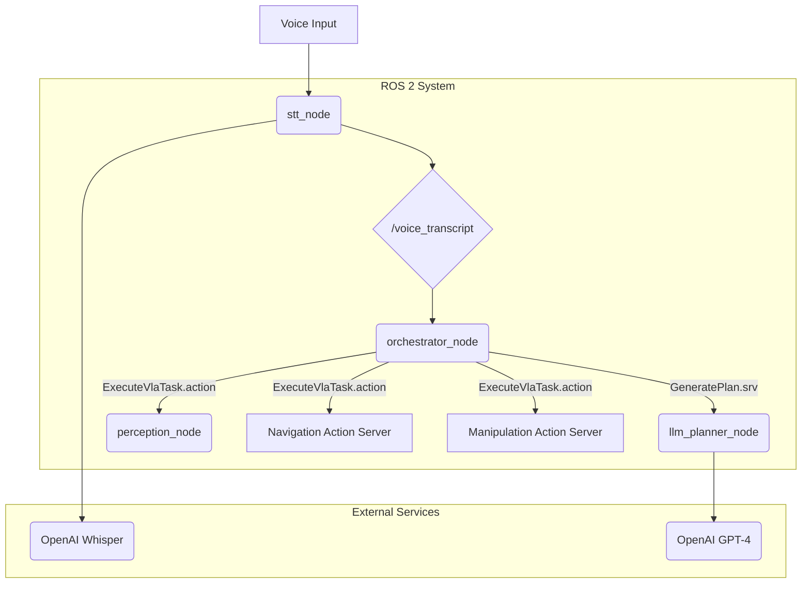

# Chapter 6: The Capstone, Putting It All Together

This is the moment we've been working towards. We have built all the individual pieces of our Vision-Language-Action pipeline: the ear, the brain, the eye, and the central nervous system. In this final chapter, we will assemble them into a single, cohesive system and run our end-to-end capstone demo in Isaac Sim.

### Learning Objectives

By the end of this chapter, you will be able to:

-   Create a master ROS 2 launch file to start multiple nodes at once.
-   Understand the complete data flow of a VLA pipeline.
-   Run and test the full autonomous humanoid assistant demo.
-   Appreciate the challenges and opportunities in building integrated AI robotics systems.

---

## 1. The Full Picture: System Integration

Let's revisit our architecture diagram one last time. Now, you should understand the role of every single component.



The `orchestrator_node` is the key. It listens for the output of the `stt_node`, calls the `llm_planner_node` to get a plan, and then uses the `perception_node` and other action servers to execute that plan. This is a complete, closed-loop system where the robot can sense, think, and act autonomously.

---

## 2. Preparing the Simulation Environment

Before we launch our code, we need a world to test it in.

1.  **Launch Isaac Sim**: Start NVIDIA Isaac Sim.
2.  **Load a Scene**: Open a pre-built scene, for example, the "Carter Warehouse" environment, or create your own simple room.
3.  **Add a Robot**: Add a humanoid robot model to the scene, such as the NVIDIA "JetBot" (for simplicity) or a full "Carter" robot. Ensure it has a camera attached.
4.  **Add Objects**: Place a few simple objects with distinct colors in the scene, like a red can, a blue box, and a green sphere. Make sure they are in a location the robot can navigate to.
5.  **Enable ROS 2 Bridge**: In Isaac Sim, activate the ROS 2 bridge. This will make the robot's sensors (camera), and controllers available as ROS 2 topics and services. Configure the camera to publish RGB, depth, and semantic segmentation images.

---

## 3. The Master Launch File (`vla_bringup.launch.py`)

To run our entire system, we don't want to open four different terminals. Instead, we'll create a master launch file that starts all of our nodes with a single command. Create a new ROS 2 package called `vla_bringup` and add this launch file.

```python
# src/vla_bringup/launch/vla_bringup.launch.py

from launch import LaunchDescription
from launch_ros.actions import Node

def generate_launch_description():
    """
    Launches all nodes for the VLA capstone project.
    """
    
    # The STT Node that listens for voice commands
    stt_node = Node(
        package='vla_nodes',
        executable='stt_node',
        name='stt_node',
        output='screen'
    )
    
    # The LLM Planner Node that generates plans
    llm_planner_node = Node(
        package='vla_nodes',
        executable='llm_planner_node',
        name='llm_planner_node',
        output='screen'
    )
    
    # The Perception Node for finding objects
    perception_node = Node(
        package='vla_nodes',
        executable='perception_node',
        name='perception_node',
        output='screen'
    )
    
    # The Orchestrator Node that manages the whole process
    orchestrator_node = Node(
        package='vla_nodes',
        executable='orchestrator_node',
        name='orchestrator_node',
        output='screen'
    )
    
    # In a real scenario, you would also launch the nodes for navigation (Nav2)
    # and manipulation (MoveIt2) here, or ensure they are already running.
    # For this textbook example, we assume they are launched separately.

    return LaunchDescription([
        stt_node,
        llm_planner_node,
        perception_node,
        orchestrator_node
    ])
```

Make sure to add all the Python nodes from the `vla_nodes` package as entry points in its `setup.py` so the launch file can find them.

---

## 4. Running the End-to-End Demo

This is it! Follow these steps to see your creation come to life.

1.  **Build your workspace**:
    ```bash
    cd /path/to/your/ros2_ws
    colcon build
    source install/setup.bash
    ```

2.  **Set API Key**:
    ```bash
    export OPENAI_API_KEY='your-api-key-here'
    ```

3.  **Start Isaac Sim**: Make sure your simulated world is running with the robot and objects.

4.  **Launch the VLA System**:
    ```bash
    ros2 launch vla_bringup vla_bringup.launch.py
    ```
    You should see the logs from all four of our nodes starting up. The Orchestrator will report that it is in the `IDLE` state.

5.  **Issue a Voice Command**:
    Speak clearly into your microphone: **"Please get me the red can."**

6.  **Observe the Magic**:
    Watch the logs in your terminal. You should see the following sequence:
    -   The `stt_node` transcribes your speech and publishes it.
    -   The `orchestrator_node` receives the transcript and calls the planner.
    -   The `llm_planner_node` receives the request, calls GPT-4, and returns a plan like: `["navigate to the table", "find the red can", "pick up the red can"]`.
    -   The `orchestrator_node` begins executing the first step. It calls the `/execute_vla_task` action with the goal "navigate to the table".
    -   The `navigation_node` (which we assume is running) would handle this, and the robot would drive to the table.
    -   Once navigation succeeds, the `orchestrator_node` executes the next step: "find the red can".
    -   The `perception_node` handles this, using the camera to locate the can and return its coordinates.
    -   Finally, the `orchestrator_node` executes "pick up the red can", which would be handled by the `manipulation_node`.

You have built a robot that can sense, think, and act.

---

## 5. Final Reflections and Next Steps

This module was a huge leap, but you've assembled a system that represents the cutting edge of AI robotics.

**Common Failure Modes:**
-   **Noisy Environment**: The STT might fail, leading to bad plans.
-   **LLM Hallucination**: The LLM might generate a plan with impossible steps. Better prompt engineering or fine-tuning can help here.
-   **Perception Failure**: Bad lighting or object occlusion can cause the perception node to fail. This is a massive area of research in robotics.
-   **Execution Failure**: The robot might fail to grasp an object or get stuck. This requires robust error handling in the action servers.

**Where to Go From Here?**
-   **Improve Robustness**: Add error handling. What should the orchestrator do if a step fails? Retry? Ask the user for help?
-   **More Complex Commands**: Expand the prompt to handle more complex sentences and a wider variety of tasks.
-   **Physical Hardware**: The ultimate test! Adapting this system to a real robot is a challenging but incredibly rewarding project.

Congratulations on completing this course! You now have the foundational skills to build the next generation of intelligent robots.
